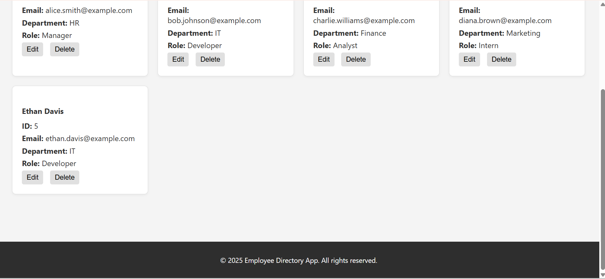

# Employee Directory

A simple and responsive Employee Directory web application built with HTML, CSS, and vanilla JavaScript. It allows users to add, edit, delete, search, sort, filter, and paginate through employee data dynamically — all without any backend or data persistence.

---

## 🔧 Setup Instructions

No backend or build tools required. Just follow these steps:

1. **Download or clone** this repository:
   ```bash
   git clone https://github.com/bhagyasri1908/employee-directory.git
Open the project folder:

bash
Copy
Edit
cd employee-directory
Run the application:

Open src/main/resources/templates/index.html directly in your browser.

To add or edit employees, navigate to form.html.

📁 Folder Structure
css
Copy
Edit
employee-directory/
├── src/
│   └── main/
│       └── resources/
│           ├── static/
│           │   ├── css/
│           │   │   └── style.css          # All app styling
│           │   └── js/
│           │       ├── app.js            # Dashboard logic (search, filter, sort, paginate)
│           │       ├── form.js           # Add/Edit form logic with validation
│           │       └── data.js           # Mock employee data (in-memory only)
│           └── templates/
│               ├── index.html            # Main dashboard page
│               └── form.html             # Add/Edit employee form page
├── README.md
✨ Features
🔍 Search by employee name or email

🧮 Sort by first name or department

🎯 Filter by first name, department, or role

➕ Add, ✏️ Edit, and 🗑️ Delete employees

📄 Pagination (10/25/50/100 per page)

✅ Inline form validation for required fields and email format

📱 Responsive Design for desktop, tablet, and mobile screens

⚡ Fully vanilla JS, no frameworks or libraries used

📸 Screenshots
(Optional – Add yours here)


🤔 Reflection
Challenges Faced
Ensuring all operations (search, sort, filter, pagination) work together without bugs.

Making the layout clean and fully responsive without any CSS frameworks.

Implementing inline form validation with helpful error messages.

What I'd Improve
Add a confirmation modal for delete actions.

Improve accessibility with ARIA roles and better keyboard navigation.

Add animated transitions to improve UX.

Refactor code into modules for better scalability and maintainability.

🧑‍💻 Author
Bhagyasri
GitHub Profile → https://github.com/bhagyasri1908/employee-directory 

Screenshots 

![Dashboard] (screenshots/employeeDashboard1.png)



